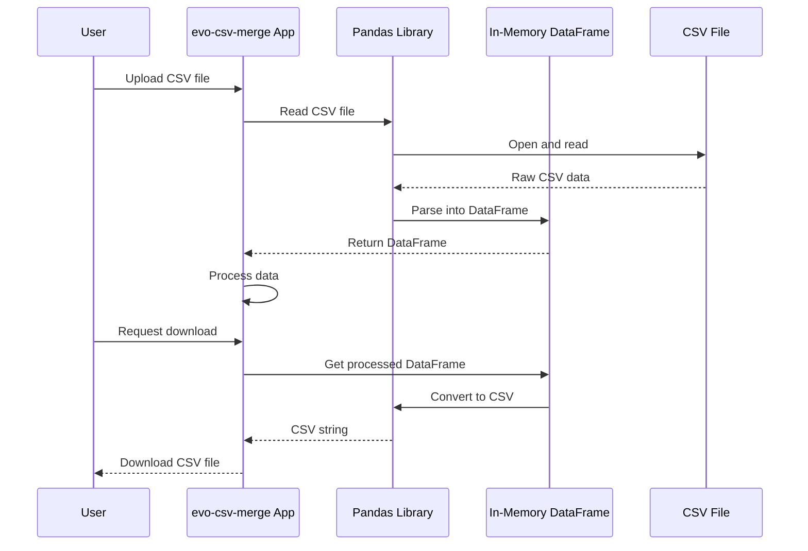

# Chapter 1: CSV File Handling

## Introduction: Why CSV Files Matter

Have you ever worked with spreadsheets in Excel or Google Sheets? When you need to share that data with other programs or systems, CSV files are often the go-to solution. CSV (Comma-Separated Values) files are simple text files that store tabular data - like a simplified spreadsheet where each line is a row and values are separated by commas.

In our `evo-csv-merge` project, the ability to handle CSV files is the foundation of everything we'll do. Let's explore why this is so important and how it works.

## What You'll Learn

By the end of this chapter, you'll understand:
- What CSV files are and why they're useful
- How to read CSV files into your Python program
- How to convert CSV data into a format you can work with (pandas DataFrames)
- How to save processed data back to CSV files

## What Are CSV Files?

A CSV file might look like this when opened in a text editor:

```
name,age,city
John,28,New York
Sarah,35,Chicago
Miguel,42,Los Angeles
```

Each line represents a row of data, and the values are separated by commas. The first row is typically a header row that names each column.

CSV files are popular because:
- They're simple and lightweight
- Almost every data tool can read them
- They're human-readable
- They work across different platforms and languages

## Reading CSV Files in Python

The most popular way to work with CSV files in Python is using the `pandas` library, which provides powerful data manipulation tools. Here's how to read a CSV file:

```python
import pandas as pd

# Read a CSV file into a DataFrame
df = pd.read_csv("data.csv")

# Show the first few rows
print(df.head())
```

This code imports the pandas library (with the common nickname `pd`), reads a CSV file named "data.csv", and stores the data in a DataFrame called `df`. The `head()` method shows the first few rows to give you a preview.

## Understanding DataFrames

A DataFrame is like a table in memory - it has rows and columns similar to a spreadsheet. Once your CSV data is in a DataFrame, you can:

- Access specific columns or rows
- Filter data based on conditions
- Perform calculations
- Merge with other data
- Clean and transform the data

DataFrames are the central data structure we'll use throughout this project. We'll explore them more deeply in [DataFrame Manipulation](02_dataframe_manipulation_.md).

## Saving Data Back to CSV

After processing your data, you'll often want to save it back to a CSV file:

```python
# Save DataFrame to a CSV file
df.to_csv("processed_data.csv", index=False)
```

The `index=False` parameter prevents pandas from adding an extra index column to your output file.

## Real-World Example from evo-csv-merge

Let's look at how CSV file handling works in our project. Here's a simplified excerpt from the code:

```python
# Upload and read CSV files
uploaded_files = st.file_uploader("Choose CSV files", type="csv", accept_multiple_files=True)

dataframes = []
if uploaded_files:
    for file in uploaded_files:
        file.seek(0)
        df = pd.read_csv(file)
        dataframes.append(df)
```

This code:
1. Creates a file upload widget using Streamlit's `file_uploader`
2. Initializes an empty list to store DataFrames
3. Loops through each uploaded file
4. Reads each CSV file into a pandas DataFrame
5. Adds each DataFrame to our list

Later in the code, after processing the data, we save it back to a CSV file:

```python
# Download the processed data
if st.button("Download cleaned data"):
    for i, df in enumerate(dataframes):
        csv = df.to_csv(index=False)
        b64 = base64.b64encode(csv.encode()).decode()
        href = f'<a href="data:file/csv;base64,{b64}" download="cleaned_data_{i + 1}.csv">Download cleaned_data_{i + 1}.csv</a>'
        st.markdown(href, unsafe_allow_html=True)
```

This code:
1. Creates a download button
2. When clicked, it converts each DataFrame back to CSV format
3. Encodes the CSV data for download
4. Creates a download link for the user

## How CSV File Handling Works Under the Hood

Let's visualize the CSV file handling process:



When you upload a CSV file, pandas:
1. Opens the file and reads the raw text
2. Detects the delimiter (usually a comma)
3. Parses the first row as column names
4. Parses each subsequent row as data
5. Attempts to infer data types (numbers, text, dates, etc.)
6. Creates a DataFrame with this structured data

## CSV Reading Implementation Details

The core of our CSV reading functionality is the pandas `read_csv()` function. It has many options, but here are the key ones:

```python
pd.read_csv(
    filepath_or_buffer,  # File path or file-like object
    delimiter=',',       # Column separator (default is comma)
    header=0,            # Row to use as column names (0 = first row)
    index_col=None,      # Column to use as index
    usecols=None,        # Which columns to read (None = all)
    dtype=None,          # Data types for columns
    # many more options...
)
```

For example, if your CSV uses semicolons instead of commas:

```python
df = pd.read_csv("data.csv", delimiter=';')
```

## CSV Writing Implementation Details

Similarly, the `to_csv()` method has options:

```python
df.to_csv(
    path_or_buf=None,    # File path or buffer (None = return as string)
    sep=',',             # Separator character
    index=True,          # Whether to write row indices
    header=True,         # Whether to write column names
    # many more options...
)
```

In our application, we use this to create downloadable files:

```python
csv_string = df.to_csv(index=False)  # Convert DataFrame to CSV string
```

## Common Challenges with CSV Files

When working with CSV files, be aware of these potential issues:

1. **Delimiter confusion**: Some CSV files use separators other than commas (like semicolons or tabs)
2. **Quoted fields**: Fields containing commas must be quoted, which can cause parsing issues
3. **Character encoding**: Different CSV files might use different encodings (UTF-8, Latin-1, etc.)
4. **Data types**: Pandas tries to guess data types, but sometimes needs guidance

For most CSV files, pandas handles these issues automatically, but for problematic files, you might need additional parameters:

```python
df = pd.read_csv(
    "tricky_file.csv",
    delimiter=';',       # Using semicolons instead of commas
    quotechar='"',       # Character used for quoting fields
    encoding='latin-1',  # Specific encoding
    dtype={'ID': str}    # Force ID column to be string, not number
)
```

## Conclusion

CSV file handling is the foundation of our data processing pipeline. We use it to:
1. Import data from CSV files into our application
2. Convert that data into pandas DataFrames for processing
3. Export the processed results back to CSV files for the user to download

This ability to seamlessly move between file storage and in-memory data structures is what makes our application flexible and powerful.

Now that you understand how to work with CSV files, we'll explore how to manipulate the data within those DataFrames in the next chapter: [DataFrame Manipulation](02_dataframe_manipulation_.md).

---

Generated by [AI Codebase Knowledge Builder](https://github.com/The-Pocket/Tutorial-Codebase-Knowledge)