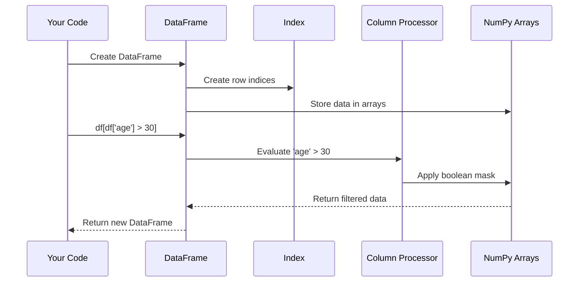

# Chapter 2: DataFrame Manipulation

In the [CSV File Handling](01_csv_file_handling_.md) chapter, we learned how to read and write CSV files. Once our data is loaded from CSV files, we need a powerful way to work with it. This is where DataFrames come in!

## What is a DataFrame?

Think of a DataFrame as a smart spreadsheet in your code. While a CSV file is just text on disk, a DataFrame is an in-memory data structure that lets you:

- View your data in rows and columns
- Sort and filter information
- Transform and combine data
- Perform calculations and analysis

In the `evo-csv-merge` project, DataFrames are the backbone of everything we do. They allow us to manipulate CSV data before merging files together.

## Creating and Viewing DataFrames

Let's start with a simple example. Imagine we have this CSV data:

```
name,age,city
John,28,New York
Sarah,35,Chicago
Miguel,42,Los Angeles
```

After loading it with pandas, we get a DataFrame:

```python
import pandas as pd

# Create a simple DataFrame
df = pd.DataFrame({
    'name': ['John', 'Sarah', 'Miguel'],
    'age': [28, 35, 42],
    'city': ['New York', 'Chicago', 'Los Angeles']
})

# Display the DataFrame
print(df)
```

This code creates a DataFrame with three columns and three rows. When you run it, you'll see:

```
     name  age         city
0    John   28     New York
1   Sarah   35      Chicago
2  Miguel   42  Los Angeles
```

Notice that pandas automatically added an index column (the numbers 0, 1, 2) on the left.

## Basic DataFrame Operations

Let's explore common operations you'll use in the `evo-csv-merge` project:

### 1. Accessing Columns

```python
# Get a single column
names = df['name']
print(names)

# Get multiple columns
subset = df[['name', 'city']]
print(subset)
```

The first line returns a Series (a single column of data), while the second returns a new DataFrame with just the selected columns.

### 2. Filtering Rows

```python
# Filter rows where age is over 30
older_people = df[df['age'] > 30]
print(older_people)

# Filter by multiple conditions
from_chicago = df[(df['city'] == 'Chicago') & (df['age'] > 30)]
print(from_chicago)
```

Here we're creating boolean masks (True/False for each row) and using them to select only rows that match our conditions.

### 3. Adding and Modifying Columns

```python
# Add a new column
df['birth_year'] = 2023 - df['age']
print(df)

# Modify an existing column
df['name'] = df['name'].str.upper()
print(df)
```

The first line calculates birth years for everyone. The second line converts all names to uppercase.

### 4. Basic Statistics and Information

```python
# Get summary statistics
print(df.describe())

# Get information about the DataFrame
print(df.info())

# Count values in a column
print(df['city'].value_counts())
```

These methods help you understand your data, showing things like averages, min/max values, and how many values of each type you have.

## DataFrames in evo-csv-merge

Now let's see how DataFrames are used in our project. Here's a simplified example from the code:

```python
# From csv_merger_streamlit.py
def perform_join(self, left_key: str, right_key: str, join_type: str) -> bool:
    # Get our two DataFrames
    left_df = self.left_df.copy()
    right_df = self.right_df.copy()
    
    # Rename right key to match left key if they're different
    if left_key != right_key:
        right_df = right_df.rename(columns={right_key: left_key})
    
    # Perform a merge operation
    self.merged_df = pd.merge(
        left_df, right_df, on=left_key, how=join_type, suffixes=('_left', '_right')
    )
    
    return True
```

This code:
1. Makes copies of two DataFrames (to avoid modifying the originals)
2. Renames a column in the right DataFrame if needed
3. Merges (joins) the DataFrames based on matching key columns
4. Returns the merged result

This is a core operation in `evo-csv-merge` - combining data from two CSV files using a shared key.

## How DataFrames Work Under the Hood

Let's see what happens when we perform DataFrame operations:



When you create or manipulate a DataFrame:

1. Pandas uses NumPy arrays to store the actual data
2. It maintains an index to keep track of rows
3. It maintains column labels
4. When you filter or transform, it applies operations to these arrays
5. Most operations return a new DataFrame rather than modifying the original

This is why DataFrames are so efficient - they use optimized numerical libraries underneath!

## Handling Missing Data

When working with real-world data in `evo-csv-merge`, you'll often encounter missing values. Here's how to handle them:

```python
# Check for missing values
print(df.isna().sum())

# Fill missing values
df['age'] = df['age'].fillna(0)

# Drop rows with any missing values
df_clean = df.dropna()

# Drop rows where all values are missing
df_clean = df.dropna(how='all')
```

This is important when merging CSVs that might have incomplete data. Note how in the `datacleaning_app.py` file we can remove empty rows:

```python
if remove_empty_rows == "Yes":
    merged_df.dropna(how="all", inplace=True)
```

The `inplace=True` parameter modifies the DataFrame directly instead of creating a new one.

## Advanced Selection and Transformation

Let's look at some more powerful DataFrame operations used in our project:

```python
# Select specific rows and columns
result = df.iloc[0:2, 1:3]  # First 2 rows, columns 1-2

# Apply a function to each element
df['name_length'] = df['name'].apply(len)

# Group by a column and aggregate
city_stats = df.groupby('city').agg({
    'age': ['mean', 'min', 'max'],
    'name': 'count'
})
```

These operations let you slice, transform, and analyze your data in sophisticated ways. The `iloc` method uses numerical positions, while the `loc` method (not shown) uses labels.

## Real-World Example: Merging DataFrames

The heart of the `evo-csv-merge` project is merging DataFrames. Here's a simplified example:

```python
# Example of inner join
merged_df = pd.merge(
    left_df,          # First DataFrame
    right_df,         # Second DataFrame
    on='customer_id', # Join key
    how='inner',      # Join type
    suffixes=('_left', '_right')  # Rename duplicate columns
)
```

This code finds rows where the `customer_id` matches in both DataFrames and combines them. The `how` parameter can be:
- `'inner'`: Only keep rows that match in both DataFrames
- `'left'`: Keep all rows from the left DataFrame
- `'right'`: Keep all rows from the right DataFrame
- `'outer'`: Keep all rows from both DataFrames

In the next chapter, [Join Operations](03_join_operations_.md), we'll explore these joining techniques in much more detail.

## Conclusion

DataFrames are the workhorses of data manipulation in Python. In the `evo-csv-merge` project, they provide:

1. A structured way to represent tabular data in memory
2. Powerful tools for filtering, transforming, and analyzing data
3. Methods for combining data from different sources
4. Efficient handling of large datasets

Understanding DataFrames is crucial for working with CSV data effectively. Now that you're familiar with the basics, we'll dive deeper into [Join Operations](03_join_operations_.md) to learn how to combine DataFrames in different ways.

---

Generated by [AI Codebase Knowledge Builder](https://github.com/The-Pocket/Tutorial-Codebase-Knowledge)