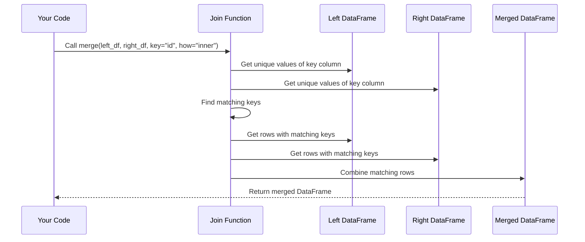

# Chapter 3: Join Operations

In the [DataFrame Manipulation](02_dataframe_manipulation_.md) chapter, we learned how to work with data inside a single DataFrame. But what if our data is spread across multiple files? That's where join operations come in!

## Why Do We Need to Join Data?

Imagine you have two spreadsheets:
1. A list of customers with their IDs and names
2. A list of orders with customer IDs and product information

To answer questions like "What did customer Sarah buy?", you need to combine these spreadsheets based on the customer ID. This is exactly what join operations help us do!

## Understanding Join Operations with a Guest List Analogy

Think of join operations like combining two guest lists for an event:

- **Party A List**: People invited by the bride
- **Party B List**: People invited by the groom

Depending on how you want to combine these lists, you have different options:

- **Inner Join**: Only include guests who appear on BOTH lists (the intersection)
- **Left Join**: Include ALL guests from the bride's list, plus matching guests from the groom's list
- **Right Join**: Include ALL guests from the groom's list, plus matching guests from the bride's list  
- **Outer Join**: Include ALL guests from BOTH lists, with no duplicates (the union)
- **Union**: Simply stack both guest lists together (might include duplicates)

Let's see how each of these works in practice!

## Types of Join Operations

### Inner Join: The Intersection

An inner join keeps only the rows that have matching values in both DataFrames.

```python
# Example of inner join
merged_df = pd.merge(
    customers_df,        # First DataFrame
    orders_df,           # Second DataFrame
    on='customer_id',    # Join key
    how='inner'          # Join type
)
```

This code finds customers who have placed orders and combines their information. If a customer hasn't placed an order, they won't appear in the result.


### Left Join: Keep Everything from the Left

A left join keeps all rows from the left DataFrame and matching rows from the right.

```python
# Example of left join
merged_df = pd.merge(
    customers_df,        # First DataFrame (LEFT)
    orders_df,           # Second DataFrame (RIGHT)
    on='customer_id',    # Join key
    how='left'           # Join type
)
```

This code keeps ALL customers, whether they've placed orders or not. For customers without orders, the order information will be filled with NaN (missing values).


### Right Join: Keep Everything from the Right

A right join is the opposite of a left join - it keeps all rows from the right DataFrame and matching rows from the left.

```python
# Example of right join
merged_df = pd.merge(
    customers_df,        # First DataFrame (LEFT)
    orders_df,           # Second DataFrame (RIGHT)
    on='customer_id',    # Join key
    how='right'          # Join type
)
```

This keeps ALL orders, even if we don't have information about the customer who placed them.


### Outer Join: Keep Everything from Both

An outer join (sometimes called "full join") keeps all rows from both DataFrames.

```python
# Example of outer join
merged_df = pd.merge(
    customers_df,        # First DataFrame
    orders_df,           # Second DataFrame
    on='customer_id',    # Join key
    how='outer'          # Join type
)
```

This keeps ALL customers and ALL orders, filling in missing values with NaN where necessary.


### Union: Stack Everything Together

A union simply stacks the two DataFrames on top of each other.

```python
# Example of union
merged_df = pd.concat([customers_df, orders_df])
```

This works best when both DataFrames have the same columns. Unlike the other joins, this doesn't try to match records based on a key.

## Real-World Example: Combining Customer and Order Data

Let's see a concrete example. Imagine we have these two simple DataFrames:

**Customers DataFrame:**
```
   customer_id   name      email
0  C001         Alice     alice@example.com
1  C002         Bob       bob@example.com
2  C003         Charlie   charlie@example.com
```

**Orders DataFrame:**
```
   order_id   customer_id   product        amount
0  O001      C001          Laptop         1200.00
1  O002      C002          Headphones     89.99
2  O003      C001          Mouse          24.99
3  O004      C005          Keyboard       49.99
```

Notice that:
- Alice (C001) has two orders
- Bob (C002) has one order
- Charlie (C003) has no orders
- There's an order from C005, but we don't have this customer in our customers table

Let's see what each join type would produce:

### Inner Join Result
```
   customer_id   name    email              order_id   product      amount
0  C001         Alice    alice@example.com  O001       Laptop       1200.00
1  C001         Alice    alice@example.com  O003       Mouse        24.99
2  C002         Bob      bob@example.com    O002       Headphones   89.99
```

Notice Charlie doesn't appear (no matching orders) and the C005 order doesn't appear (no matching customer).

### Left Join Result
```
   customer_id   name     email               order_id   product      amount
0  C001         Alice     alice@example.com   O001       Laptop       1200.00
1  C001         Alice     alice@example.com   O003       Mouse        24.99
2  C002         Bob       bob@example.com     O002       Headphones   89.99
3  C003         Charlie   charlie@example.com NaN        NaN          NaN
```

All customers appear, but Charlie has NaN for order information.

### Right Join Result
```
   customer_id   name    email              order_id   product      amount
0  C001         Alice    alice@example.com  O001       Laptop       1200.00
1  C001         Alice    alice@example.com  O003       Mouse        24.99
2  C002         Bob      bob@example.com    O002       Headphones   89.99
3  C005         NaN      NaN                O004       Keyboard     49.99
```

All orders appear, but the C005 customer has NaN for customer information.

### Outer Join Result
```
   customer_id   name     email               order_id   product      amount
0  C001         Alice     alice@example.com   O001       Laptop       1200.00
1  C001         Alice     alice@example.com   O003       Mouse        24.99
2  C002         Bob       bob@example.com     O002       Headphones   89.99
3  C003         Charlie   charlie@example.com NaN        NaN          NaN
4  C005         NaN       NaN                 O004       Keyboard     49.99
```

Everything appears, with NaN where information is missing.

## Implementing Join Operations in evo-csv-merge

Now let's see how these join operations are implemented in our project. Here's a simplified version of the join code:

```python
def perform_join(self, left_key, right_key, join_type):
    # Make copies to avoid modifying originals
    left_df = self.left_df.copy()
    right_df = self.right_df.copy()
    
    # Rename right key if needed
    if left_key != right_key:
        right_df = right_df.rename(columns={right_key: left_key})
    
    # Perform the join operation
    self.merged_df = pd.merge(
        left_df, right_df, on=left_key, how=join_type
    )
```

This code:
1. Makes copies of both DataFrames
2. Renames the key column in the right DataFrame if it's different
3. Uses pandas' `merge()` function to join the DataFrames
4. Stores the result in `self.merged_df`

Notice that before joining, we rename the key column in the right DataFrame to match the left one. This allows pandas to find the matching records.

## How Joins Work Under the Hood

Let's see what happens step-by-step when you perform a join:



For an inner join, pandas:
1. Looks at the key column in both DataFrames
2. Identifies values that appear in both
3. For each matching value, combines the corresponding rows
4. Returns a new DataFrame with the combined rows

For other join types, the process is similar but with different rules for which rows to include.

## Handling Different Column Names

Sometimes your key columns have different names in each DataFrame. For example, "customer_id" in one file and "cust_id" in another. You can handle this in two ways:

```python
# Option 1: Specify left_on and right_on
merged_df = pd.merge(
    customers_df, orders_df,
    left_on='customer_id',
    right_on='cust_id',
    how='inner'
)

# Option 2: Rename one column first
orders_df = orders_df.rename(columns={'cust_id': 'customer_id'})
merged_df = pd.merge(
    customers_df, orders_df,
    on='customer_id',
    how='inner'
)
```

In our `evo-csv-merge` project, we use the second approach - renaming the right column to match the left one before joining.

## Handling Duplicate Column Names

When joining DataFrames, you might have columns with the same name in both. Pandas adds suffixes to disambiguate:

```python
merged_df = pd.merge(
    customers_df, orders_df,
    on='customer_id',
    how='inner',
    suffixes=('_customer', '_order')
)
```

This would rename duplicate columns, for example turning "date" into "date_customer" and "date_order".

In our project, we use '_left' and '_right' as suffixes:

```python
# From the project code
self.merged_df = pd.merge(
    left_df, right_df,
    on=left_key,
    how='inner', 
    suffixes=('_left', '_right')
)
```

## Choosing the Right Join Type

Here's a simple guide to help you choose which join type to use:

1. **Inner Join**: When you want only records that have matches in both datasets
   - Example: Active customers who have placed orders

2. **Left Join**: When you want everything from the first dataset, with matching records from the second
   - Example: All customers, with their order details if available

3. **Right Join**: When you want everything from the second dataset, with matching records from the first
   - Example: All orders, with customer details if available

4. **Outer Join**: When you want everything from both datasets
   - Example: All customers and all orders, even if they don't match

5. **Union**: When you want to stack two similar datasets
   - Example: Combining this month's customers with last month's customers

## Conclusion

Join operations are powerful tools for combining data from different sources. By understanding the different types of joins - inner, left, right, outer, and union - you can combine your data in exactly the way you need.

In this chapter, we've seen:
- How different join types work using a guest list analogy
- Real examples of each join type with customer and order data
- How joins are implemented in the `evo-csv-merge` project
- The step-by-step process that happens during a join operation

Now that you understand how to combine datasets using joins, let's explore how to make this process even easier with [Automatic Key Detection](04_automatic_key_detection_.md), which helps identify which columns to join on.

---

Generated by [AI Codebase Knowledge Builder](https://github.com/The-Pocket/Tutorial-Codebase-Knowledge)