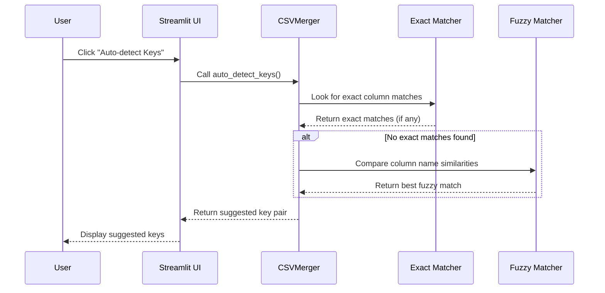

# Chapter 4: Automatic Key Detection

In the [Join Operations](03_join_operations_.md) chapter, we learned how to combine datasets using various join methods. But before we can join two CSV files, we need to identify which columns to join on. This is where Automatic Key Detection comes in!

## What is Automatic Key Detection?

Imagine you have two CSV files from different sources:
- A customer database with fields like `customer_id`, `name`, and `email`
- A sales record with fields like `cust_id`, `purchase_date`, and `amount`

To join these files, you need to know that `customer_id` and `cust_id` contain the same information. Manually finding these matching columns can be tedious, especially with large datasets.

**Automatic Key Detection** is like having a smart assistant that looks at your columns and says, "Hey, I think these two columns probably contain the same information!"

## Why Automatic Key Detection Matters

Without automatic detection, you'd need to:
1. Open both CSV files
2. Scan through all column names
3. Compare them manually to find matches
4. Hope you don't miss any important connections

This is time-consuming and error-prone. Automatic detection makes the process faster and more reliable.

## How Automatic Key Detection Works

Let's break down how our system finds matching columns:

### 1. Exact Matching

The simplest approach is finding column names that are identical in both datasets:

```python
# Find column names that appear in both DataFrames
left_cols = set(left_df.columns)
right_cols = set(right_df.columns)
exact_matches = left_cols.intersection(right_cols)
```

This code creates sets of column names from both DataFrames and finds their intersection - column names that appear in both.

### 2. Prioritizing Common Key Names

Some column names are frequently used as keys. Our system prioritizes these:

```python
# Check if common key names are in our matches
priority_keys = ['id', 'ID', 'key', 'Key', 'code', 'Code', 'name', 'Name']
for key in priority_keys:
    if key in exact_matches:
        return key, key
```

If we find columns named "id" or "key" in both datasets, they're likely good join candidates.

### 3. Fuzzy Matching

What if the columns have similar but not identical names? This is where fuzzy matching comes in:

```python
# Look for similar column names using fuzzy matching
for left_col in left_cols:
    for right_col in right_cols:
        ratio = difflib.SequenceMatcher(None, left_col.lower(), right_col.lower()).ratio()
        if ratio > best_ratio:
            best_ratio = ratio
            best_match = (left_col, right_col)
```

This code compares each column name from the left DataFrame with each column name from the right DataFrame, calculating a similarity score. If the score is above our threshold, we consider it a potential match.

## A Real-World Example

Let's see automatic key detection in action with a simple example:

**Left DataFrame Columns:** `customer_id`, `name`, `email`  
**Right DataFrame Columns:** `cust_id`, `purchase_date`, `amount`

Here's what happens:

1. **Exact Matching**: No exact matches found
2. **Fuzzy Matching**: Comparing `customer_id` with `cust_id` gives a high similarity score
3. **Result**: The system suggests `customer_id` ↔ `cust_id` as the join keys

This saves you from having to manually identify that these differently named columns contain the same information.

## Using Automatic Key Detection in evo-csv-merge

Let's see how to use this feature in our project:

```python
# When user clicks the auto-detect button
if st.button("🔍 Auto-detect Keys", use_container_width=True):
    left_key, right_key = merger.auto_detect_keys()
    if left_key and right_key:
        st.session_state.left_key = left_key
        st.session_state.right_key = right_key
        st.success(f"Auto-detected: {left_key} ↔ {right_key}")
    else:
        st.warning("No matching keys found. Please select manually.")
```

With a single button click, the system:
1. Analyzes both DataFrames
2. Finds the best matching columns
3. Automatically selects them for you
4. Shows you what it found

## How It Works Under the Hood

Let's visualize what happens when you click that "Auto-detect Keys" button:



When you request auto-detection, the system first tries to find exact matches. If none are found, it falls back to fuzzy matching to find the most similar column names.

## Implementation Deep Dive

Let's explore the `auto_detect_keys()` method that powers this feature:

```python
def auto_detect_keys(self) -> Tuple[Optional[str], Optional[str]]:
    """Automatically detect the best matching key columns"""
    if self.left_df is None or self.right_df is None:
        return None, None
        
    left_cols = set(self.left_df.columns)
    right_cols = set(self.right_df.columns)
    
    # Find exact matches
    exact_matches = left_cols.intersection(right_cols)
```

This first part checks if both DataFrames are loaded and then finds columns with identical names.

```python
    if exact_matches:
        # Prioritize common key names
        priority_keys = ['id', 'ID', 'key', 'Key', 'code', 'Code', 'name', 'Name']
        for key in priority_keys:
            if key in exact_matches:
                return key, key
        # Return first exact match
        best_match = list(exact_matches)[0]
        return best_match, best_match
```

If exact matches are found, it checks if any are common key names like "id" or "key." If not, it simply returns the first match.

```python
    # Look for similar column names using fuzzy matching
    best_match = None
    best_ratio = 0.6  # Minimum similarity threshold
    
    for left_col in left_cols:
        for right_col in right_cols:
            ratio = difflib.SequenceMatcher(None, left_col.lower(), right_col.lower()).ratio()
            if ratio > best_ratio:
                best_ratio = ratio
                best_match = (left_col, right_col)
    
    return best_match if best_match else (None, None)
```

If no exact matches are found, it uses fuzzy matching to find similar column names. The `SequenceMatcher` calculates a similarity score between 0 and 1. We only consider matches with a score above 0.6 (meaning 60% similar).

## Understanding Fuzzy Matching

Think of fuzzy matching like spellcheck. When you type "recieve," spellcheck knows you meant "receive" because the words are similar. In the same way, fuzzy matching can tell that "customer_id" and "cust_id" probably refer to the same thing.

The `SequenceMatcher` algorithm works by:
1. Breaking the strings into matching blocks
2. Finding the longest common subsequence
3. Calculating a ratio based on the length of matching parts divided by the total length

For example:
- "customer_id" vs. "cust_id" might get a score of 0.75
- "first_name" vs. "last_name" might get a score of 0.35
- "product_id" vs. "prod_code" might get a score of 0.65

## Practical Example: Auto-detecting Keys

Let's walk through a complete example:

**Left DataFrame:**
```
customer_id | first_name | last_name | email
-----------|-----------|-----------|-----------
1001       | John      | Smith     | john@example.com
1002       | Alice     | Jones     | alice@example.com
```

**Right DataFrame:**
```
cust_id    | purchase_date | product    | amount
-----------|---------------|------------|-------
1001       | 2023-01-15    | Laptop     | 1200.00
1002       | 2023-02-20    | Headphones | 89.99
```

When you click "Auto-detect Keys":

1. Check for exact matches: None found
2. Try fuzzy matching:
   - "customer_id" vs. "cust_id" → 0.75 similarity
   - "first_name" vs. "purchase_date" → 0.14 similarity
   - ... (other comparisons) ...
3. Best match: "customer_id" ↔ "cust_id"
4. System suggests these as join keys

## Using Automatic Key Detection with Join Operations

Once the keys are detected, they're automatically selected in the UI dropdowns:

```python
left_key = st.selectbox(
    "Left file join key:",
    options=[""] + left_cols,
    index=left_cols.index(st.session_state.get('left_key', '')) + 1 if st.session_state.get('left_key', '') in left_cols else 0
)
```

This code sets the dropdown selection to the automatically detected key, making it easy to proceed to the join operation with a single click.

## Tips for Better Key Detection

1. **Use consistent naming conventions** in your datasets to improve exact matching
2. **Look for similar prefixes/suffixes** (e.g., "customer_id" and "cust_id" both end with "_id")
3. **Check the suggested keys** before joining to make sure they're correct
4. **Consider column data types** - keys should typically have the same data type

## When to Override Automatic Detection

Sometimes you may want to override the automatic suggestions:

1. When multiple valid join keys exist (e.g., you could join on either "email" or "customer_id")
2. When similar column names have different meanings (e.g., "ship_date" and "shop_date")
3. When you want to join on multiple columns together

In these cases, simply select your preferred columns from the dropdowns after auto-detection.

## Conclusion

Automatic Key Detection makes joining datasets much easier by intelligently suggesting which columns to use as keys. It combines exact matching for identical column names with fuzzy matching for similar ones, saving you time and reducing errors.

Now that you know how to automatically detect join keys, let's explore how all these features come together in the [CSVMerger Class](05_csvmerger_class_.md), which encapsulates the core functionality of our application.

---

Generated by [AI Codebase Knowledge Builder](https://github.com/The-Pocket/Tutorial-Codebase-Knowledge)