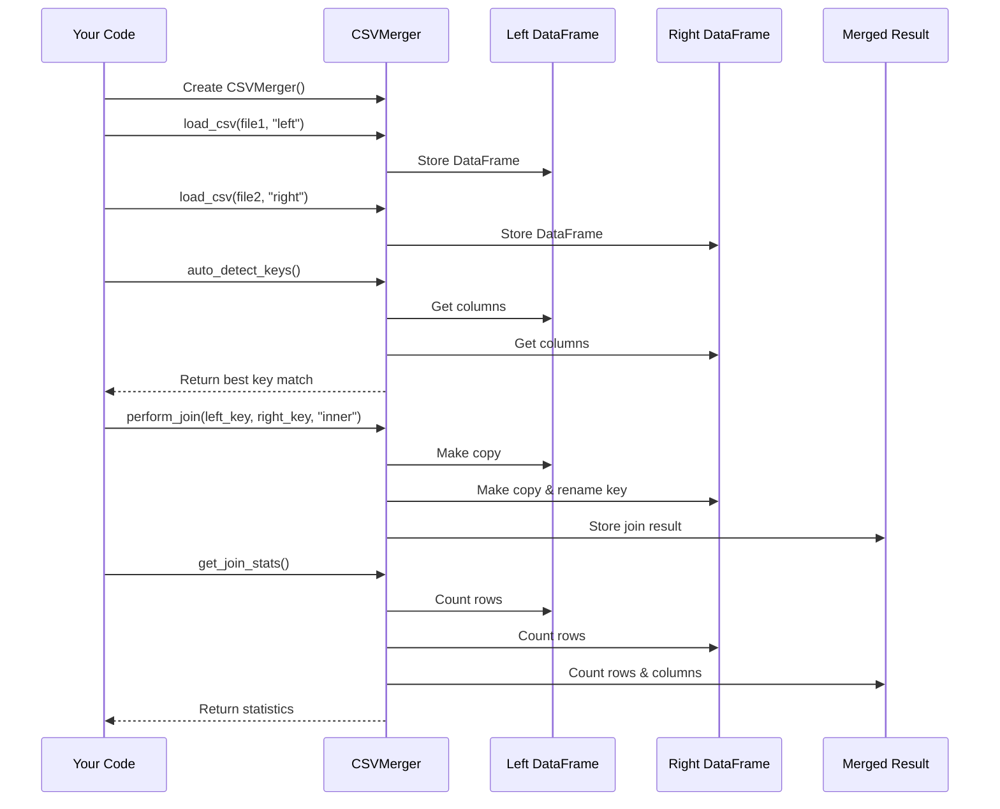

# Chapter 5: CSVMerger Class

In the [Automatic Key Detection](04_automatic_key_detection_.md) chapter, we learned how our application can intelligently find matching columns between two CSV files. Now, let's explore how all these features come together in the CSVMerger class - the heart of our `evo-csv-merge` project!

## What is the CSVMerger Class?

Imagine you're a chef preparing a complex dish. You need various tools, ingredients, and techniques. Without proper organization, cooking becomes chaotic. That's where a recipe comes in - it coordinates everything into a cohesive process.

The CSVMerger class is like that recipe - it coordinates all aspects of merging CSV files:

- Loading CSV files
- Providing information about their columns
- Detecting matching keys
- Performing different types of joins
- Calculating statistics about the results

Instead of scattering this functionality throughout our code, we package it all in one organized class.

## A Real-World Example

Let's say you're analyzing sales data. You have two CSV files:

1. `customers.csv` - containing customer information
2. `orders.csv` - containing order details

You want to combine these files to answer questions like "What's the average order value for customers in California?"

With CSVMerger, the process becomes straightforward:

```python
# Create a merger instance
merger = CSVMerger()

# Load your CSV files
merger.load_csv("customers.csv", "left")
merger.load_csv("orders.csv", "right")

# Detect or select join keys
left_key, right_key = merger.auto_detect_keys()

# Perform the join operation
merger.perform_join(left_key, right_key, "left")

# Access your merged data
result = merger.merged_df
```

This simple flow handles all the complexity of merging your data!

## Core Features of the CSVMerger Class

Let's break down the main features of this class:

### 1. Initializing the Merger

When you create a CSVMerger instance, it sets up three important properties:

```python
def __init__(self):
    self.left_df = None      # Will hold the first DataFrame
    self.right_df = None     # Will hold the second DataFrame
    self.merged_df = None    # Will hold the result after merging
```

These properties store your data at different stages of the merging process.

### 2. Loading CSV Files

The `load_csv` method handles importing your files:

```python
def load_csv(self, uploaded_file, file_side: str) -> bool:
    try:
        if uploaded_file is not None:
            df = pd.read_csv(uploaded_file)
            if file_side == "left":
                self.left_df = df
            else:
                self.right_df = df
            return True
    except Exception as e:
        # Handle errors
        return False
```

This method takes a file and a side ("left" or "right") and loads the CSV into the appropriate DataFrame. It returns `True` if successful, making it easy to check if the file loaded correctly.

### 3. Getting Column Information

To help users choose join columns, we need to know what columns are available:

```python
def get_column_names(self, side: str) -> List[str]:
    """Get column names for specified side"""
    df = self.left_df if side == "left" else self.right_df
    return list(df.columns) if df is not None else []
```

This method returns a list of column names from either the left or right DataFrame. It's used to populate dropdown menus in the UI.

### 4. Auto-Detecting Join Keys

As we learned in the [Automatic Key Detection](04_automatic_key_detection_.md) chapter, this feature helps identify matching columns:

```python
def auto_detect_keys(self) -> Tuple[Optional[str], Optional[str]]:
    # Find exact matches first
    left_cols = set(self.left_df.columns)
    right_cols = set(self.right_df.columns)
    exact_matches = left_cols.intersection(right_cols)
    
    # If no exact matches, try fuzzy matching
    # (Implementation details covered in previous chapter)
```

This method returns a pair of column names that are likely good candidates for joining.

### 5. Performing Join Operations

The most important method handles the actual merging of DataFrames:

```python
def perform_join(self, left_key: str, right_key: str, join_type: str) -> bool:
    # Create copies of original DataFrames
    left_df = self.left_df.copy()
    right_df = self.right_df.copy()
    
    # Rename right key if needed
    if left_key != right_key:
        right_df = right_df.rename(columns={right_key: left_key})
    
    # Perform the join
    self.merged_df = pd.merge(
        left_df, right_df, on=left_key, how=join_type
    )
    
    return True
```

This method handles:
- Creating copies to avoid modifying the original data
- Renaming columns if the keys have different names
- Performing the actual join operation
- Storing the result in `merged_df`

### 6. Getting Merge Statistics

After merging, it's helpful to know some basic statistics:

```python
def get_join_stats(self) -> Dict[str, int]:
    """Get statistics about the join operation"""
    stats = {
        "left_records": len(self.left_df) if self.left_df is not None else 0,
        "right_records": len(self.right_df) if self.right_df is not None else 0,
        "result_records": len(self.merged_df) if self.merged_df is not None else 0,
        "result_columns": len(self.merged_df.columns) if self.merged_df is not None else 0
    }
    return stats
```

This provides information like how many rows and columns are in each DataFrame, which helps users understand the results of their merge.

## How CSVMerger Works Under the Hood

Let's visualize what happens when you use the CSVMerger class:



This diagram shows the flow of data through the CSVMerger class. Each step builds on the previous ones:

1. First, you create a CSVMerger instance
2. Then you load your CSV files into left and right DataFrames
3. Next, you identify which columns to join on
4. Then you perform the join operation
5. Finally, you can get statistics about the result

## Practical Example: Using CSVMerger in Our Application

Here's how the CSVMerger class is used in the Streamlit app:

```python
# Initialize the merger
if 'merger' not in st.session_state:
    st.session_state.merger = CSVMerger()

merger = st.session_state.merger

# Load files when uploaded
left_file = st.file_uploader("Choose LEFT CSV file", type=['csv'])
left_loaded = merger.load_csv(left_file, "left")
```

This code initializes a CSVMerger instance and stores it in the session state, so it persists between interactions. Then it handles file uploads.

For auto-detecting keys:

```python
# Auto-detect button
if st.button("🔍 Auto-detect Keys"):
    left_key, right_key = merger.auto_detect_keys()
    if left_key and right_key:
        st.session_state.left_key = left_key
        st.session_state.right_key = right_key
        st.success(f"Auto-detected: {left_key} ↔ {right_key}")
```

This code calls the `auto_detect_keys()` method when the user clicks a button, then displays the result.

For performing joins:

```python
# When user clicks join button
if st.button("🔗 Perform Join"):
    if merger.perform_join(left_key, right_key, join_type):
        # Show results
        stats = merger.get_join_stats()
        st.metric("Result Records", stats["result_records"])
```

This code performs the join operation and displays statistics about the result.

## Making Your Own CSVMerger

If you were to implement a simplified version of CSVMerger, here's what it might look like:

```python
class SimpleCSVMerger:
    def __init__(self):
        self.left_df = None
        self.right_df = None
        self.result_df = None
    
    def load_left(self, filename):
        self.left_df = pd.read_csv(filename)
    
    def load_right(self, filename):
        self.right_df = pd.read_csv(filename)
    
    def join(self, left_key, right_key, join_type="inner"):
        if self.left_df is None or self.right_df is None:
            return False
        
        self.result_df = pd.merge(
            self.left_df, 
            self.right_df, 
            left_on=left_key,
            right_on=right_key,
            how=join_type
        )
        return True
```

This simplified version captures the essential functionality - loading files and joining them.

## Benefits of Using the CSVMerger Class

The CSVMerger class provides several advantages:

1. **Organization**: All related functionality is grouped together
2. **State Management**: It maintains the state of your data at each stage
3. **Error Handling**: It centralizes error checking and handling
4. **Reusability**: The same code can be used in different parts of the application
5. **Abstraction**: It hides complex implementation details behind a simple interface

## When to Use CSVMerger

The CSVMerger class is most useful when:

1. You need to merge two CSV files based on matching columns
2. You want to try different types of joins (inner, left, right, outer)
3. You need to track statistics about the merge operation
4. You want automatic detection of matching columns

## Conclusion

The CSVMerger class is the central component of our `evo-csv-merge` project. It coordinates loading files, detecting keys, performing joins, and calculating statistics. By packaging all this functionality into a single class, we create a clean, organized structure that's easy to use and maintain.

Now that you understand how to use the CSVMerger class to combine datasets, let's explore how to clean and prepare that data in the next chapter: [Data Cleaning Operations](06_data_cleaning_operations_.md).

---

Generated by [AI Codebase Knowledge Builder](https://github.com/The-Pocket/Tutorial-Codebase-Knowledge)