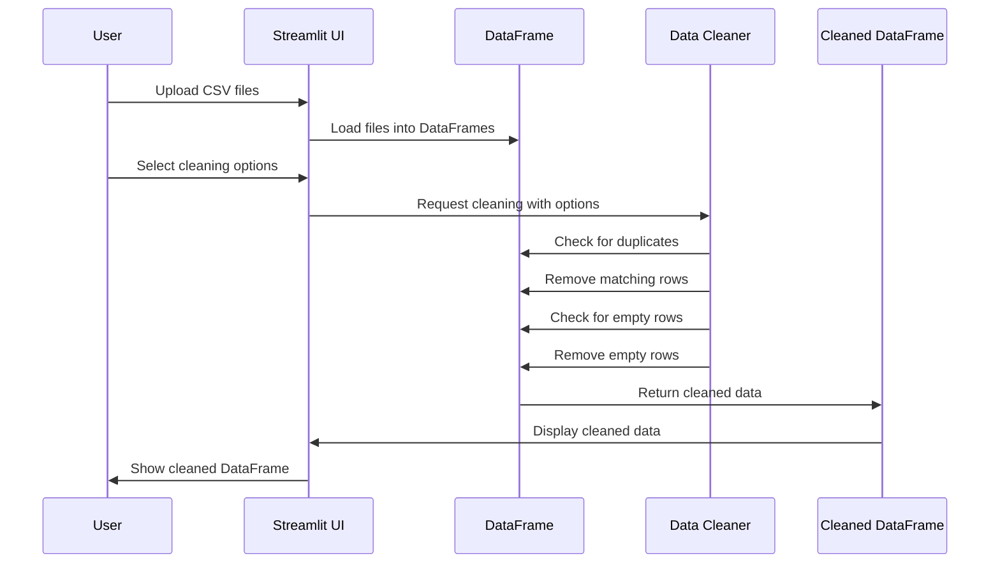

# Chapter 6: Data Cleaning Operations

In the [CSVMerger Class](05_csvmerger_class_.md) chapter, we learned how to organize our code for merging CSV files. Now, let's explore an equally important aspect: cleaning up messy data before we merge it!

## Why Clean Your Data?

Imagine you're a chef preparing ingredients for a recipe. Before you start cooking, you need to wash the vegetables, remove any spoiled parts, and chop everything into consistent sizes. Data cleaning is just like that—it's preparing your raw data so it's ready to be used.

Let's say you've collected customer feedback from multiple stores in CSV files. Before analyzing this data, you need to:
- Remove duplicate entries (a customer who submitted twice)
- Remove empty rows (forms that weren't filled out)
- Make sure column names are consistent across files (one store used "Customer_Name" while another used "customer_name")

Let's learn how to handle these common data cleaning tasks!

## Key Data Cleaning Operations

### 1. Removing Duplicate Rows

Duplicate data can skew your analysis. For example, if a customer appears twice in your dataset, they might be counted twice in your statistics.

Here's how to remove duplicates:

```python
# Remove duplicate rows from a DataFrame
df.drop_duplicates(inplace=True)
```

This code uses pandas' `drop_duplicates()` method to remove any rows that are exact copies of other rows. The `inplace=True` parameter means it modifies the original DataFrame rather than creating a new one.

### 2. Removing Empty Rows

Empty rows waste space and can cause issues during analysis:

```python
# Remove rows where all values are empty
df.dropna(how="all", inplace=True)
```

This code drops any row where all values are missing (NaN). The `how="all"` parameter specifies that every value in the row must be missing for it to be removed.

### 3. Standardizing Headers

When merging files from different sources, column names might not match exactly:

```python
# Make second DataFrame use the column names from the first
second_df.columns = first_df.columns
```

This simple code assigns the column names from the first DataFrame to the second one, ensuring they match before merging.

## Real-World Example: Cleaning Customer Feedback Data

Let's walk through a common scenario. You have feedback forms from three store locations, and you want to combine and clean them:

```python
# Load three CSV files with customer feedback
store1_df = pd.read_csv("store1_feedback.csv")
store2_df = pd.read_csv("store2_feedback.csv")
store3_df = pd.read_csv("store3_feedback.csv")
```

Now let's clean this data:

```python
# Standardize headers (store2 used different column names)
store2_df.columns = store1_df.columns

# Combine all three DataFrames
combined_df = pd.concat([store1_df, store2_df, store3_df])
```

The `pd.concat()` function stacks the DataFrames on top of each other. Next, let's remove any duplicates and empty rows:

```python
# Remove duplicate entries (customers who submitted twice)
combined_df.drop_duplicates(inplace=True)

# Remove completely empty rows
combined_df.dropna(how="all", inplace=True)
```

Now our data is clean and ready for analysis!

## How Data Cleaning Works in evo-csv-merge

Our project includes these cleaning operations in an easy-to-use interface. Let's see how it works in practice:

```python
# User selects cleaning options through the UI
remove_duplicate_rows = st.selectbox("Remove duplicate rows", ["No", "Yes"])
remove_empty_rows = st.selectbox("Remove empty rows", ["Yes", "No"])
```

These Streamlit controls create dropdown menus where users can choose whether to apply each cleaning operation. Then the code applies these choices:

```python
# Apply the cleaning operations based on user choices
if remove_duplicate_rows == "Yes":
    merged_df.drop_duplicates(inplace=True)

if remove_empty_rows == "Yes":
    merged_df.dropna(how="all", inplace=True)
```

## What Happens Under the Hood

Let's visualize what happens when you clean your data:



When you click "Clean Data," the system:
1. Checks your CSV files for issues
2. Applies each cleaning operation you selected
3. Returns a cleaned version of your data

## Deeper Look: How Duplicate Removal Works

Let's explore how `drop_duplicates()` works internally:

1. It creates a hash value for each row based on its contents
2. It keeps track of which hash values it has seen
3. When it encounters a hash it's seen before, it marks that row for removal
4. It creates a new DataFrame without the marked rows

This is why it's so efficient even with large datasets!

## Common Data Cleaning Challenges

### 1. Partial Duplicates

Sometimes rows aren't exact duplicates but contain mostly the same information:

```python
# Remove duplicates based on specific columns
df.drop_duplicates(subset=['customer_id', 'purchase_date'], inplace=True)
```

This removes rows that have the same customer_id and purchase_date, even if other fields differ.

### 2. Case Sensitivity in Headers

Different systems might use different capitalization in column names:

```python
# Convert all column names to lowercase
df.columns = [col.lower() for col in df.columns]
```

This standardizes all column names to lowercase, preventing issues when merging.

### 3. Extra Spaces

Sometimes data contains unnecessary spaces:

```python
# Remove leading/trailing spaces from a text column
df['customer_name'] = df['customer_name'].str.strip()
```

This removes spaces at the beginning and end of each value in the customer_name column.

## Practical Example from the Code

Let's look at how our `evo-csv-merge` project implements these cleaning operations:

```python
# From datacleaning_app.py
if keep_first_header_only == "Yes":
    for i, df in enumerate(dataframes[1:]):
        df.columns = dataframes[0].columns.intersection(df.columns)
        dataframes[i+1] = df
```

This code handles header standardization by using the `intersection()` method to find column names that exist in both DataFrames, ensuring compatibility.

For combining multiple files:

```python
# Combine all DataFrames
merged_df = pd.concat(dataframes, ignore_index=True, join='outer')
```

The `ignore_index=True` parameter creates a new index for the combined DataFrame, and `join='outer'` keeps all columns from all DataFrames.

## Tips for Effective Data Cleaning

1. **Always examine your data first** - Use `df.head()` and `df.info()` to understand your data before cleaning
2. **Make copies before cleaning** - Use `df.copy()` to avoid unintentionally modifying your original data
3. **Clean incrementally** - Apply one cleaning operation at a time and check the results
4. **Document your cleaning steps** - Keep track of what operations you've applied
5. **Look for patterns in missing data** - Sometimes missing values tell an important story

## Conclusion

Data cleaning is like housekeeping for your spreadsheets - it ensures your data is accurate, consistent, and ready for analysis. We've learned how to remove duplicates, eliminate empty rows, and standardize headers across files.

These operations might seem simple, but they're essential preprocessing steps that can save you from headaches later. Clean data leads to more reliable analyses and better decisions.

Now that we know how to clean our data, let's explore how to build a user-friendly interface for our application in the next chapter: [Streamlit UI Framework](07_streamlit_ui_framework_.md).

---

Generated by [AI Codebase Knowledge Builder](https://github.com/The-Pocket/Tutorial-Codebase-Knowledge)