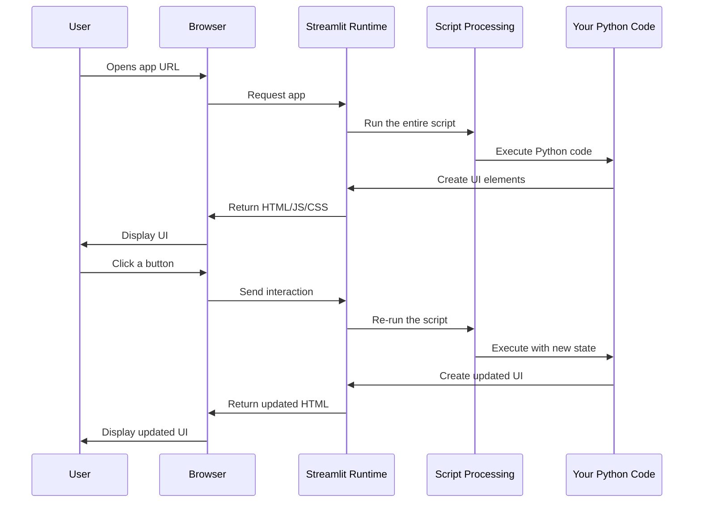

# Chapter 7: Streamlit UI Framework

In the [Data Cleaning Operations](06_data_cleaning_operations_.md) chapter, we learned how to clean and prepare our data. Now, let's explore how to build a user-friendly interface for our application using Streamlit!

## What is Streamlit and Why Use It?

Imagine you've created a powerful Python program that can merge CSV files. How do you share it with colleagues who don't know how to code? Without a user interface, they would need to:

1. Install Python
2. Set up the environment
3. Run commands from a terminal
4. Understand your code to use it properly

This is where Streamlit comes in! Streamlit transforms Python scripts into interactive web applications with minimal effort. It's like magic that turns your data processing code into a user-friendly website anyone can use.

## Understanding Streamlit: The Canvas Analogy

Think of Streamlit as a digital canvas where your Python code paints an interface:

- **Traditional Web Development**: You design the layout (HTML), style it (CSS), and add interactivity (JavaScript)
- **Streamlit Approach**: You simply write Python code that describes what elements to show

For example, creating a heading in traditional web development might require:
```html
<h1 class="main-title">CSV Merger Tool</h1>
<style>.main-title { color: blue; }</style>
```

With Streamlit, it's just:
```python
st.title("CSV Merger Tool")
```

Streamlit handles all the complicated web stuff behind the scenes!

## Key Streamlit Elements Used in Our Project

Let's explore the main Streamlit components used in our CSV merger tool:

### 1. Page Layout and Organization

```python
# Set up the basic page configuration
st.set_page_config(
    page_title="CSV Merger Tool",
    page_icon="🔗",
    layout="wide"
)

# Create a main header
st.title("🔗 CSV Merger Tool")
```

This code configures the page title, icon, and layout, then adds a title at the top. It's like setting up the frame and header for our canvas.

### 2. File Uploaders

```python
# Create a file uploader for CSV files
uploaded_file = st.file_uploader(
    "Choose a CSV file",
    type=['csv'],
    accept_multiple_files=False
)
```

This creates a file upload button that only accepts CSV files. When a user uploads a file, `uploaded_file` will contain the file data that we can process.

### 3. Interactive Controls

```python
# Create dropdown, button, and checkbox controls
join_type = st.selectbox(
    "Select join type:",
    options=["inner", "left", "right", "outer"]
)

if st.button("Perform Join"):
    # Code to merge files would go here
    st.success("Files merged successfully!")
```

These elements create interactive controls: a dropdown menu for selecting join types and a button that triggers actions when clicked. The `st.success()` function shows a green success message.

### 4. Displaying Data

```python
# Display a DataFrame as an interactive table
if merged_df is not None:
    st.subheader("Merged Data Preview")
    st.dataframe(merged_df.head(10))
    
    # Show some metrics
    st.metric("Total Rows", len(merged_df))
```

This code shows a preview of our merged data as an interactive table and displays a metric showing the total number of rows.

## How Streamlit Is Used in evo-csv-merge

Let's see a real example from our project:

```python
# From csv_merger_streamlit.py
if st.button("🔍 Auto-detect Keys", use_container_width=True):
    left_key, right_key = merger.auto_detect_keys()
    if left_key and right_key:
        st.session_state.left_key = left_key
        st.session_state.right_key = right_key
        st.success(f"Auto-detected: {left_key} ↔ {right_key}")
```

This code creates a button labeled "🔍 Auto-detect Keys". When clicked, it:
1. Calls the `auto_detect_keys()` method from our merger
2. Stores the detected keys in Streamlit's session state (to remember them)
3. Shows a success message with the detected keys

The button's appearance and the success message are handled automatically by Streamlit!

## Streamlit's Magic: How It Works Under the Hood

Let's visualize what happens when a user interacts with our Streamlit app:



The key insight: Streamlit **re-runs your entire script** when users interact with controls! This reactive approach means:

1. You don't need to write event handlers
2. Your app's state is always consistent with your code
3. The UI automatically updates based on the current state

## Understanding Streamlit's Session State

In traditional web apps, you need to manage state carefully. Streamlit makes this easier with `st.session_state`:

```python
# Initialize a value in session state
if 'left_key' not in st.session_state:
    st.session_state.left_key = ""

# Use the value
selected_key = st.selectbox(
    "Left join key:",
    options=column_names,
    index=column_names.index(st.session_state.left_key) if st.session_state.left_key in column_names else 0
)

# Update the value
st.session_state.left_key = selected_key
```

Session state lets you store data between re-runs of your script, making it possible to remember user selections and processed data.

## Organizing Streamlit Apps with Layouts

Streamlit offers several ways to organize your interface:

```python
# Create columns for side-by-side elements
col1, col2 = st.columns(2)

with col1:
    st.header("Left File")
    st.dataframe(left_df)

with col2:
    st.header("Right File")
    st.dataframe(right_df)
```

This code creates a two-column layout with data previews side by side. You can also use `st.sidebar` for a permanent sidebar and `st.expander` for collapsible sections.

## Practical Example: Building a Simple CSV Viewer

Let's create a minimal CSV viewer to understand Streamlit better:

```python
import streamlit as st
import pandas as pd

st.title("Simple CSV Viewer")

uploaded_file = st.file_uploader("Upload CSV", type="csv")

if uploaded_file:
    # Read the CSV
    df = pd.read_csv(uploaded_file)
    
    # Show the data
    st.dataframe(df)
    
    # Show some statistics
    st.write(f"Rows: {len(df)}, Columns: {len(df.columns)}")
```

This 13-line app provides a complete CSV file viewer! It:
1. Creates a title
2. Adds a file uploader
3. Loads the CSV when uploaded
4. Displays the data as an interactive table
5. Shows basic statistics

## Common Streamlit Patterns in Our Project

### 1. Conditional Display

```python
# Only show results if data is available
if merger.merged_df is not None:
    st.header("📊 Merge Results")
    st.dataframe(merger.merged_df)
else:
    st.info("Upload and merge files to see results")
```

This pattern ensures UI elements only appear when they're relevant.

### 2. Progress Indicators

```python
# Show progress during long operations
with st.spinner("Merging files..."):
    merged_df = merger.perform_join(left_key, right_key, join_type)
    st.success("Merge complete!")
```

The spinner shows a loading animation during time-consuming operations.

### 3. Error Handling

```python
# Handle errors gracefully
try:
    result = merger.perform_join(left_key, right_key, join_type)
except Exception as e:
    st.error(f"Error: {str(e)}")
    st.stop()  # Stop execution
```

This pattern shows user-friendly error messages instead of crashing.

## Customizing the Look and Feel

While Streamlit has good default styling, you can customize it:

```python
# Add custom CSS
st.markdown("""
<style>
    .main-header {
        background: linear-gradient(135deg, #4facfe 0%, #00f2fe 100%);
        padding: 2rem;
        border-radius: 10px;
        color: white;
    }
</style>
""", unsafe_allow_html=True)

# Use the custom style
st.markdown('<div class="main-header">CSV Merger Tool</div>', unsafe_allow_html=True)
```

This adds custom CSS styling to create a gradient header. Note that `unsafe_allow_html=True` is needed to apply custom HTML/CSS.

## Streamlit vs. Traditional Web Frameworks

Why use Streamlit instead of frameworks like Flask or Django?

| Framework | Learning Curve | Code Required | Deployment Complexity |
|-----------|----------------|---------------|------------------------|
| Streamlit | Minimal        | ~10-50 lines  | Very Simple            |
| Flask     | Moderate       | ~100-500 lines| Moderate               |
| Django    | Steep          | 500+ lines    | Complex                |

Streamlit's main advantage is how quickly you can create interactive apps with minimal code and without needing to know web development.

## Tips for Better Streamlit Apps

1. **Keep it simple**: Focus on functionality first, then improve the UI
2. **Use session state wisely**: Store only what you need between reruns
3. **Add caching** with `@st.cache_data` for expensive operations
4. **Use columns and containers** to organize your layout
5. **Add helpful messages** to guide users through your app

## Conclusion

Streamlit transforms Python data processing code into user-friendly web applications with minimal effort. In our `evo-csv-merge` project, Streamlit provides:

1. File uploaders for CSV files
2. Interactive controls for configuring merge operations
3. Dynamic displays for showing data and results
4. Error messages and success notifications
5. A clean, organized interface anyone can use

By using Streamlit, we've made our powerful CSV merging code accessible to non-programmers without sacrificing functionality.

Now that you understand how to build a user interface with Streamlit, let's explore how to let users download their processed data in the next chapter: [File Download Functionality](08_file_download_functionality_.md).

---

Generated by [AI Codebase Knowledge Builder](https://github.com/The-Pocket/Tutorial-Codebase-Knowledge)