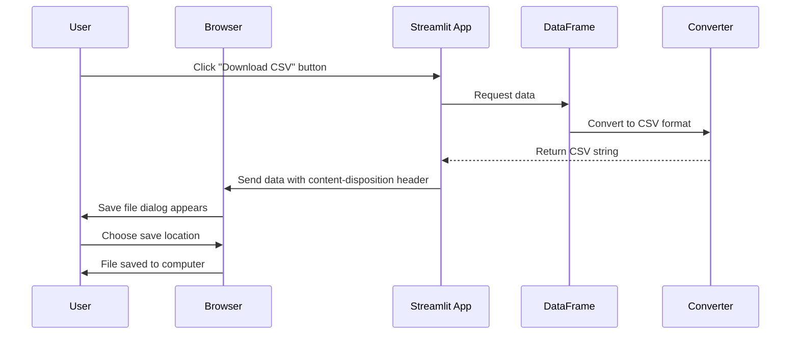

# Chapter 8: File Download Functionality

In the [Streamlit UI Framework](07_streamlit_ui_framework_.md) chapter, we learned how to build a user-friendly interface for our application. Now, let's explore how to let users download their processed data!

## Why Data Downloads Matter

Imagine you've used our app to merge and clean several CSV files. The result looks perfect in the app, but how do you get this data onto your computer to use in other programs? This is where file download functionality comes in!

Without download options, your data would be trapped in the browser. With proper download functionality, users can:

1. Save their processed data to their computers
2. Open the data in Excel, Google Sheets, or other tools
3. Share the results with colleagues
4. Use the data in other systems or applications

## Understanding Data Downloads: The Export Station Analogy

Think of file download functionality like the shipping department at the end of a factory assembly line:

1. Your raw materials (CSV files) enter the factory
2. They go through various processing stations (cleaning, merging, etc.)
3. Finally, they arrive at the export station (download functionality)
4. Here, the finished products are packaged (converted to the desired format)
5. And then shipped out (downloaded to the user's computer)

Just as a factory might package products in different types of containers depending on customer needs, our app can provide downloads in different formats: CSV, Excel, or JSON.

## Basic CSV Download Implementation

Let's start with the simplest approach - creating a CSV download button:

```python
# Convert DataFrame to CSV string
csv = df.to_csv(index=False)

# Create download button
st.download_button(
    label="Download CSV",
    data=csv,
    file_name="processed_data.csv",
    mime="text/csv"
)
```

This code does two key things:
1. Converts our DataFrame to a CSV string
2. Creates a download button that users can click to save the file

When clicked, the browser will download the file to the user's computer with the name "processed_data.csv".

## Supporting Multiple File Formats

Users may need different file formats depending on how they plan to use the data:

```python
# Create download options for different formats
col1, col2 = st.columns(2)

with col1:
    # CSV download
    csv_data = df.to_csv(index=False)
    st.download_button("Download CSV", csv_data, "data.csv", "text/csv")
    
with col2:
    # JSON download
    json_data = df.to_json(orient='records')
    st.download_button("Download JSON", json_data, "data.json")
```

This code creates two download buttons side by side:
1. The first for downloading CSV format
2. The second for downloading JSON format

This gives users flexibility to choose the format that works best for their needs.

## Adding Excel Download Support

Excel is a popular format that requires a bit more processing:

```python
# Create Excel file in memory
buffer = io.BytesIO()
with pd.ExcelWriter(buffer, engine='openpyxl') as writer:
    df.to_excel(writer, sheet_name='Data', index=False)

# Get Excel data and create download button
excel_data = buffer.getvalue()
st.download_button("Download Excel", excel_data, "data.xlsx")
```

This code:
1. Creates an in-memory buffer to hold our Excel file
2. Uses pandas' ExcelWriter to convert the DataFrame to Excel format
3. Gets the binary data from the buffer
4. Creates a download button for the Excel file

## How File Downloads Work Under the Hood

Let's visualize what happens when a user clicks a download button:



When the user clicks the download button:
1. Streamlit asks pandas to convert the DataFrame to the desired format
2. The data is prepared and encoded appropriately
3. Streamlit sends the data back to the browser with instructions to download it
4. The browser shows a save dialog for the user to choose where to save the file
5. The file is saved to the user's computer

## Implementation in our `evo-csv-merge` Project

Now let's look at how file downloads are implemented in our project. Here's a simplified version from our code:

```python
# Download button section
st.subheader("💾 Download Results")

# Prepare CSV for download
csv_buffer = io.StringIO()
filtered_df.to_csv(csv_buffer, index=False)
csv_data = csv_buffer.getvalue()

st.download_button(
    label="📥 Download Merged CSV",
    data=csv_data,
    file_name="merged_data.csv",
    mime="text/csv"
)
```

This creates a clearly labeled section for downloads with an emoji and a subheader, then adds a CSV download button.

For additional formats, our project includes code like this:

```python
# Additional download options
col1, col2 = st.columns(2)

with col1:
    # Excel download
    excel_buffer = io.BytesIO()
    with pd.ExcelWriter(excel_buffer, engine='openpyxl') as writer:
        filtered_df.to_excel(writer, sheet_name='Merged Data', index=False)
    excel_data = excel_buffer.getvalue()
    
    st.download_button(
        label="📊 Download as Excel",
        data=excel_data,
        file_name="merged_data.xlsx",
        mime="application/vnd.openxmlformats-officedocument.spreadsheetml.sheet"
    )

with col2:
    # JSON download
    json_data = filtered_df.to_json(orient='records', indent=2)
    
    st.download_button(
        label="🔄 Download as JSON",
        data=json_data,
        file_name="merged_data.json",
        mime="application/json"
    )
```

This code creates a two-column layout with Excel and JSON download options side by side.

## Understanding the Different File Formats

Let's explore the three formats we support:

### 1. CSV (Comma-Separated Values)
- **Pros**: Simple, widely compatible, small file size
- **Cons**: Limited formatting, no multiple sheets
- **Best for**: Importing into other data tools, simple datasets

### 2. Excel (XLSX)
- **Pros**: Retains formatting, supports multiple sheets
- **Cons**: Larger file size, less universal compatibility
- **Best for**: Sharing with non-technical users, complex formatting

### 3. JSON (JavaScript Object Notation)
- **Pros**: Preserves data types, hierarchical structure
- **Cons**: Less human-readable, not as spreadsheet-friendly
- **Best for**: Web applications, programming interfaces

## Legacy Method: Base64 Encoding

In older Streamlit versions, downloads required a more complex approach using base64 encoding:

```python
# Old method using base64 encoding
csv = df.to_csv(index=False)
b64 = base64.b64encode(csv.encode()).decode()
href = f'<a href="data:file/csv;base64,{b64}" download="data.csv">Download CSV</a>'
st.markdown(href, unsafe_allow_html=True)
```

This code:
1. Converts the DataFrame to CSV
2. Encodes it in base64 (a way to represent binary data as text)
3. Creates an HTML link with the encoded data
4. Renders the link with Streamlit's markdown function

While this method still works, the newer `st.download_button()` approach is simpler and recommended.

## Common Challenges with File Downloads

### 1. Large File Sizes

When working with large datasets, downloads might be slow or fail completely:

```python
# For large files, consider adding a progress message
with st.spinner("Preparing download (this may take a moment)..."):
    csv_data = huge_df.to_csv(index=False)
    st.download_button("Download Large CSV", csv_data, "large_data.csv")
```

The spinner provides feedback while the file is being prepared.

### 2. Character Encoding Issues

Sometimes non-English characters can cause problems:

```python
# Explicitly set encoding for international characters
csv_data = df.to_csv(index=False, encoding='utf-8-sig')
st.download_button("Download CSV with International Characters", 
                  csv_data, "international_data.csv")
```

The `utf-8-sig` encoding includes a byte order mark that helps Excel recognize the encoding correctly.

## Tips for Better Download Functionality

1. **Clear labeling**: Use descriptive names for your download buttons
2. **Multiple formats**: Provide options for different use cases
3. **Visual cues**: Use icons or emojis to make download buttons stand out
4. **Informative filenames**: Include date or description in default filenames
5. **Feedback**: Show spinner or progress for large files

## Practical Example: A Complete Download Section

Let's see how to create a well-designed download section:

```python
st.subheader("Download Your Processed Data")

# Add helpful information
st.info("Choose the format that works best for your needs:")

# Create download buttons in a nice layout
col1, col2, col3 = st.columns(3)

with col1:
    st.download_button("📄 CSV Format", df.to_csv(index=False), 
                     "data.csv", help="Best for most data tools")
```

This code creates a clearly labeled section with helpful information and a download button with an icon, descriptive text, and a tooltip.

## Conclusion

File download functionality is the final step in our data processing pipeline - it delivers the processed data to users in formats they can use. Without it, all our data processing would be trapped in the browser, making the application much less useful.

We've learned how to:
1. Convert DataFrames to different file formats (CSV, Excel, JSON)
2. Create download buttons that let users save processed data
3. Handle different formats for different user needs
4. Provide visual cues and feedback for downloads

Now that users can download their processed data, let's explore how to help them understand that data through visualizations in the next chapter: [Data Visualization](09_data_visualization_.md).

---

Generated by [AI Codebase Knowledge Builder](https://github.com/The-Pocket/Tutorial-Codebase-Knowledge)