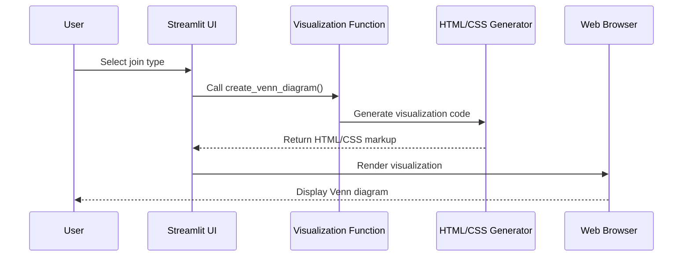

# Chapter 9: Data Visualization

In the [File Download Functionality](08_file_download_functionality_.md) chapter, we learned how users can save their processed data. Now, let's explore how visual representations can help users understand complex data operations!

## Why Visualize Data?

Have you ever heard the saying "a picture is worth a thousand words"? This is especially true when working with data. While numbers and tables are powerful, visualizations help us:

1. **See patterns** that might be hidden in raw data
2. **Understand relationships** between different data sets
3. **Make better decisions** by grasping complex concepts quickly
4. **Communicate findings** to others more effectively

In our `evo-csv-merge` project, we use visualization to help users understand what happens when they merge data using different join types. This makes abstract database operations more intuitive!

## The Power of Visual Metaphors

Let's start with a common problem: A user has two CSV files and wants to combine them, but they're not sure which join type to use. Should they use inner join? Left join? Right join?

Instead of forcing users to learn technical database terminology, we can show them what each operation does visually using a **Venn diagram**.

Think of a Venn diagram as those overlapping circles you might remember from math class:
- One circle represents data from the left file
- One circle represents data from the right file
- The overlapping section represents data that appears in both files

This simple visual metaphor instantly communicates complex data relationships!

## Implementing a Simple Venn Diagram

Let's see how we can create a basic Venn diagram using HTML and CSS in Streamlit:

```python
def create_venn_diagram():
    st.markdown("""
    <div style="text-align: center">
        <div style="display: flex; justify-content: center">
            <div style="background: blue; border-radius: 50%; width: 100px; 
                 height: 100px; opacity: 0.5; margin-right: -30px;">LEFT</div>
            <div style="background: red; border-radius: 50%; width: 100px; 
                 height: 100px; opacity: 0.5;">RIGHT</div>
        </div>
    </div>
    """, unsafe_allow_html=True)
```

This code creates a simple visualization with two overlapping circles. The `unsafe_allow_html=True` parameter allows us to use custom HTML and CSS to create our visualization.

## Enhancing the Visualization with Context

To make our Venn diagram more useful, we can add labels and explanations:

```python
def create_join_visualization(join_type):
    if join_type == "inner":
        highlight = "intersection"
    elif join_type == "left":
        highlight = "left"
    elif join_type == "right":
        highlight = "right"
    else:  # outer join
        highlight = "both"
        
    st.markdown(f"### Visual representation of {join_type} join")
    # Display appropriate Venn diagram based on join type
```

This function creates different visualizations based on the selected join type, helping users understand what will happen before they merge their data.

## How Visualizations Help Users

Let's consider a concrete example. Imagine a user has:
- A `customers.csv` file with 1000 customer records
- A `orders.csv` file with 1500 order records
- They want to analyze which customers have placed orders

Without visualization, the user might try different join types by trial and error, which is time-consuming and frustrating. With our Venn diagram:

1. The **inner join** visualization shows they'll get only customers with orders
2. The **left join** visualization shows they'll get all customers (with or without orders)
3. The **right join** visualization shows they'll get all orders (even if customer info is missing)
4. The **outer join** visualization shows they'll get everything from both files

This immediate visual feedback helps users choose the right operation for their needs!

## The Venn Diagram Implementation in evo-csv-merge

In our project, we've implemented a more advanced version of the Venn diagram:

```python
def create_venn_diagram():
    st.markdown("""
    <div class="venn-diagram">
        <h4>📊 Data Relationship Visualization</h4>
        <div style="display: flex; justify-content: center;">
            <div style="background: #4facfe; border-radius: 50%; width: 100px;">
                LEFT ONLY
            </div>
            <div style="background: purple; border-radius: 20px;">
                BOTH
            </div>
            <div style="background: #00f2fe; border-radius: 50%; width: 100px;">
                RIGHT ONLY
            </div>
        </div>
    </div>
    """, unsafe_allow_html=True)
```

This enhanced visualization uses colors and labels to clearly show the different data regions, making it easier for users to understand join operations at a glance.

## Visualizing Different Join Types

Let's look at how each join type is visualized:

### Inner Join
The inner join visualization highlights only the overlapping section, showing users they'll get records that exist in both datasets.

### Left Join
The left join visualization highlights the entire left circle plus the overlap, showing users they'll get all records from the left dataset and matching records from the right.

### Right Join
The right join visualization highlights the entire right circle plus the overlap, showing users they'll get all records from the right dataset and matching records from the left.

### Outer Join
The outer join visualization highlights both circles entirely, showing users they'll get all records from both datasets.

## How Visualization Works Under the Hood

Let's see what happens when a user interacts with our visualization:



When the user selects a join type:
1. Our visualization function is called
2. It generates HTML and CSS for the appropriate Venn diagram
3. Streamlit renders this HTML/CSS in the browser
4. The user sees a visual representation of the selected join operation

## Beyond Venn Diagrams: Other Visual Elements

Our project also uses other visual elements to enhance understanding:

### Statistics Cards

```python
# Display statistics about the merge
stats = merger.get_join_stats()

col1, col2, col3, col4 = st.columns(4)
with col1:
    st.metric("Left Records", stats["left_records"])
with col2:
    st.metric("Right Records", stats["right_records"])
```

These metric cards provide a visual summary of key numbers, making it easy to see the impact of different operations at a glance.

### Color-Coded Join Buttons

```python
# Color-coded join operation buttons
if st.button("⬅️ Left Join", use_container_width=True):
    if merger.perform_join(left_key, right_key, "left"):
        st.rerun()
```

By using emoji icons (⬅️, ➡️, 🔄) and consistent colors, we create visual cues that reinforce the mental model of different join types.

## The Psychology of Visual Learning

Why are these visualizations so effective? Research shows that:

1. **Dual coding**: When we present information both visually and textually, users can process it through two channels, strengthening understanding

2. **Reduced cognitive load**: Visual patterns are easier to recognize and remember than abstract concepts

3. **Spatial reasoning**: Venn diagrams leverage our natural ability to understand spatial relationships

By tapping into these psychological principles, our visualizations make complex data operations more intuitive and accessible.

## Tips for Effective Data Visualization

If you want to create your own visualizations:

1. **Keep it simple**: Focus on the core concept you want to communicate
2. **Use consistent colors**: Each element should have a consistent meaning
3. **Add clear labels**: Help users interpret what they're seeing
4. **Make it interactive**: Allow users to explore different scenarios
5. **Test with real users**: Make sure people actually understand your visualization

## Conclusion

Data visualization transforms abstract concepts into intuitive visual representations. In our `evo-csv-merge` project, the Venn diagram helps users understand different join types without needing to memorize technical definitions.

By making complex data operations visual, we've made our tool more accessible and user-friendly. Users can see what will happen before they merge their files, leading to better decisions and fewer mistakes.

Now that we understand how to visualize data operations, let's explore how to enhance the overall look and feel of our application in the next chapter: [Custom UI Styling](10_custom_ui_styling_.md).

---

Generated by [AI Codebase Knowledge Builder](https://github.com/The-Pocket/Tutorial-Codebase-Knowledge)