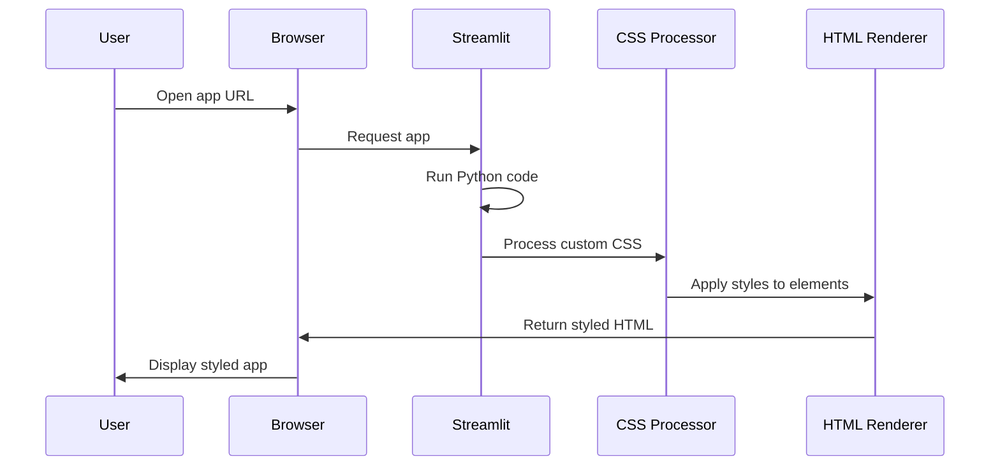

# Chapter 10: Custom UI Styling

In the [Data Visualization](09_data_visualization_.md) chapter, we learned how to create visual representations of data to help users understand complex operations. Now, let's explore how to make our entire application look more professional and user-friendly through custom UI styling!

## Why UI Styling Matters

Imagine walking into two restaurants that serve identical food. One has harsh lighting, uncomfortable chairs, and bland walls. The other has warm lighting, comfortable seating, and thoughtful decoration. Which would you prefer to dine in?

The same principle applies to web applications. Even if two apps have identical functionality, users will prefer the one that looks polished and professional. Custom UI styling is like interior design for your digital space - it creates an environment that's pleasant, intuitive, and engaging.

## Understanding CSS in Streamlit

CSS (Cascading Style Sheets) is the language used to style web pages. In Streamlit, we can add custom CSS to change colors, adjust spacing, add borders, and much more.

The basic approach is simple:

```python
st.markdown("""
<style>
    .my-custom-class {
        background-color: #f5f5f5;
        padding: 20px;
        border-radius: 10px;
    }
</style>
""", unsafe_allow_html=True)
```

This code adds a style definition for elements with the class "my-custom-class". The `unsafe_allow_html=True` parameter tells Streamlit to render the HTML and CSS rather than displaying it as text.

## Adding Custom Styles to Our Project

Let's see how we can enhance our CSV merger tool with some basic styling:

```python
# Add a custom header style
st.markdown("""
<style>
    .main-header {
        background: linear-gradient(135deg, #4facfe 0%, #00f2fe 100%);
        padding: 2rem;
        border-radius: 10px;
        color: white;
    }
</style>
""", unsafe_allow_html=True)
```

This code creates a beautiful gradient background for our header with rounded corners and white text. It's a simple change that immediately makes the app look more professional.

Now we can use this style in our header:

```python
# Apply our custom style to the header
st.markdown("""
<div class="main-header">
    <h1>🔗 CSV Merger Tool</h1>
    <p>Merge CSV files with ease</p>
</div>
""", unsafe_allow_html=True)
```

This creates a visually appealing header with our custom styling. The emoji adds a nice touch that helps users quickly identify what the app does.

## Styling Different UI Elements

Let's look at how we can style various parts of our application:

### 1. Cards for Statistics

```python
# Style for stat cards
st.markdown("""
<style>
    .stat-card {
        background: #f8f9fa;
        padding: 1rem;
        border-radius: 8px;
        border-left: 4px solid #4facfe;
    }
</style>
""", unsafe_allow_html=True)
```

This creates a clean, card-like style with a subtle left border for statistics displays. The border adds a touch of color without being overwhelming.

### 2. Success and Error Messages

```python
# Styles for feedback messages
st.markdown("""
<style>
    .success-message {
        background: #d4edda;
        border: 1px solid #c3e6cb;
        color: #155724;
        padding: 1rem;
        border-radius: 8px;
    }
</style>
""", unsafe_allow_html=True)
```

This creates a gentle green background for success messages, making them visually distinct but not distracting. Similar styles can be created for warnings and errors.

## Creating a Consistent Color Scheme

A professional application uses a consistent color palette throughout:

```python
# Define a consistent color scheme
st.markdown("""
<style>
    :root {
        --primary-color: #4facfe;
        --secondary-color: #00f2fe;
        --background-color: #f8f9fa;
        --text-color: #333333;
    }
    
    .primary-bg {
        background-color: var(--primary-color);
        color: white;
    }
</style>
""", unsafe_allow_html=True)
```

This code defines CSS variables for our color scheme, making it easy to maintain consistency throughout the app. The variables can be referenced in other style definitions.

## How UI Styling Works Under the Hood

Let's visualize what happens when we add custom styling to our Streamlit app:



When a user loads our app:
1. Streamlit runs our Python code
2. Our custom CSS is processed and combined with Streamlit's default styles
3. The styles are applied to HTML elements
4. The browser renders the styled HTML
5. The user sees a beautiful, styled application

## Real Examples from the Project

Let's look at some real styling examples from our `evo-csv-merge` project:

```python
# Main styling block from csv_merger_streamlit.py
st.markdown("""
<style>
    .main-header {
        background: linear-gradient(135deg, #4facfe 0%, #00f2fe 100%);
        padding: 2rem;
        border-radius: 10px;
        color: white;
        text-align: center;
    }
    
    .stat-card {
        background: #f8f9fa;
        padding: 1rem;
        border-radius: 8px;
        border-left: 4px solid #4facfe;
    }
</style>
""", unsafe_allow_html=True)
```

This styling block defines styles for multiple UI elements, creating a cohesive look throughout the application.

## Styling Specific Streamlit Components

Streamlit components can be targeted for styling using CSS selectors:

```python
# Style Streamlit buttons
st.markdown("""
<style>
    .stButton > button {
        background-color: #4facfe;
        color: white;
        border: none;
        border-radius: 4px;
        padding: 0.5rem 1rem;
    }
    
    .stButton > button:hover {
        background-color: #3d86c6;
    }
</style>
""", unsafe_allow_html=True)
```

This code customizes the appearance of all Streamlit buttons, giving them a blue background and white text. The `:hover` selector changes the color when users hover over buttons, providing visual feedback.

## Best Practices for UI Styling

### 1. Keep it Simple

```python
# Simple is better than complex
st.markdown("""
<style>
    /* Use subtle effects */
    .card {
        box-shadow: 0 2px 5px rgba(0,0,0,0.1);
        transition: all 0.3s ease;
    }
    
    /* Don't overdo it */
    .card:hover {
        box-shadow: 0 5px 15px rgba(0,0,0,0.1);
    }
</style>
""", unsafe_allow_html=True)
```

This example uses subtle shadows and transitions rather than flashy effects. Good design enhances usability without calling attention to itself.

### 2. Be Consistent

Maintain consistent spacing, colors, and styles throughout your app:

```python
# Consistent spacing
st.markdown("""
<style>
    /* Apply consistent spacing */
    .section {
        margin-bottom: 2rem;
    }
    
    /* Use the same border radius everywhere */
    .rounded {
        border-radius: 8px;
    }
</style>
""", unsafe_allow_html=True)
```

Consistency creates a sense of polish and professionalism that users appreciate.

## Hiding Streamlit's Default Elements

Sometimes you may want to hide Streamlit's default UI elements:

```python
# Hide default Streamlit elements
st.markdown("""
<style>
    #MainMenu {visibility: hidden;}
    footer {visibility: hidden;}
    .viewerBadge {display: none;}
</style>
""", unsafe_allow_html=True)
```

This code hides the main menu, footer, and viewer badge that Streamlit adds by default, giving you more control over your app's appearance.

## Mobile-Friendly Design

Make sure your app looks good on all devices:

```python
# Responsive design
st.markdown("""
<style>
    /* Adjust layout for small screens */
    @media (max-width: 768px) {
        .main-header {
            padding: 1rem;
        }
        
        .stat-card {
            margin-bottom: 1rem;
        }
    }
</style>
""", unsafe_allow_html=True)
```

This media query adjusts the styling when the screen width is below 768 pixels, ensuring a good experience on mobile devices.

## Conclusion

Custom UI styling transforms a functional app into a polished, professional product. Just as interior design makes a house feel like a home, thoughtful styling makes an application feel complete and trustworthy.

In this chapter, we've learned:
- How to add custom CSS to Streamlit applications
- How to style different UI elements
- How to create a consistent color scheme
- How CSS works behind the scenes
- Best practices for effective UI styling

Throughout this tutorial series, we've built a complete CSV merging application from the ground up. We started with basic [CSV File Handling](01_csv_file_handling_.md), progressed through [DataFrame Manipulation](02_dataframe_manipulation_.md) and [Join Operations](03_join_operations_.md), and added advanced features like [Automatic Key Detection](04_automatic_key_detection_.md). We organized our code in the [CSVMerger Class](05_csvmerger_class_.md), implemented [Data Cleaning Operations](06_data_cleaning_operations_.md), and created a user interface with the [Streamlit UI Framework](07_streamlit_ui_framework_.md). We added [File Download Functionality](08_file_download_functionality_.md) and [Data Visualization](09_data_visualization_.md) before finally polishing everything with Custom UI Styling.

You now have all the knowledge needed to create powerful, user-friendly data processing applications. Happy coding!

---

Generated by [AI Codebase Knowledge Builder](https://github.com/The-Pocket/Tutorial-Codebase-Knowledge)