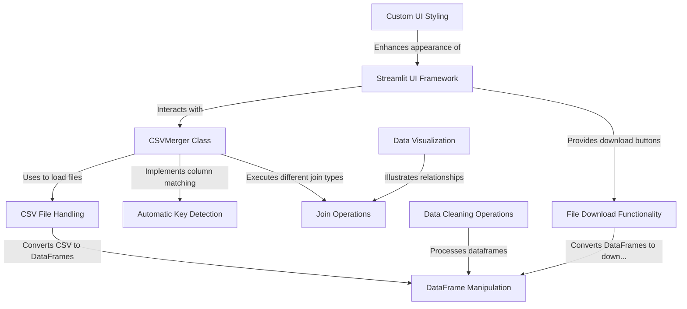

# Tutorial: evo-csv-merge

**evo-csv-merge** is a project that provides **interactive web tools** for *cleaning* and *merging* CSV files. It features two main components: a **data cleaning tool** that removes duplicates and empty rows, and an **advanced CSV merger** with *intelligent column matching* and multiple join types. Users can upload CSV files through a *user-friendly Streamlit interface*, visually preview the data relationships, and easily **download** the processed results in various formats.

**Source Repository:** [None](None)

## Chapters

1. [CSV File Handling
](01_csv_file_handling_.md)
2. [DataFrame Manipulation
](02_dataframe_manipulation_.md)
3. [Join Operations
](03_join_operations_.md)
4. [Automatic Key Detection
](04_automatic_key_detection_.md)
5. [CSVMerger Class
](05_csvmerger_class_.md)
6. [Data Cleaning Operations
](06_data_cleaning_operations_.md)
7. [Streamlit UI Framework
](07_streamlit_ui_framework_.md)
8. [File Download Functionality
](08_file_download_functionality_.md)
9. [Data Visualization
](09_data_visualization_.md)
10. [Custom UI Styling
](10_custom_ui_styling_.md)

---

Generated by [AI Codebase Knowledge Builder](https://github.com/The-Pocket/Tutorial-Codebase-Knowledge)